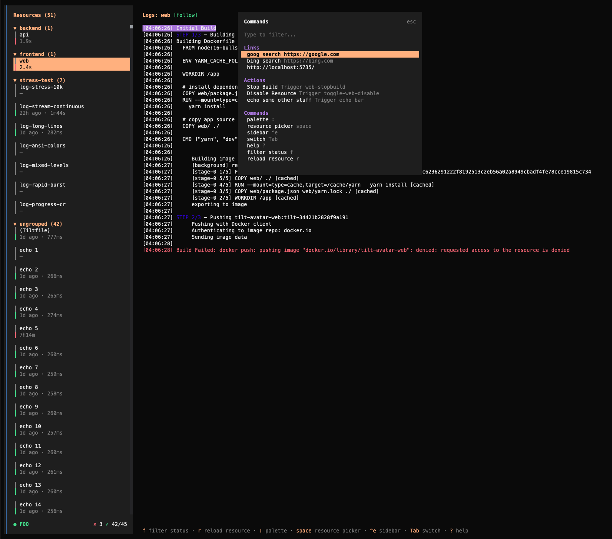

# Tilt Tui



## Requirements

- bun
- a running tilt process

## Running

### Dev Mode

```
bun install
bun dev
```

### Compile a Binary

compile a binary for the current platform

```
bun run build:binary:single

# then symlink built binary
$ which tilt-tui
/path/to/tilt-tui/dist/tilt-tui-linux-x64/bin/tilt-tui
```

### Debugging

run debug command then click lick to open javascript debug console, or attach another debugger to port.

```
❯ bun run debug
$ SHOW_CONSOLE=true bun run --inspect-wait --conditions=browser --preload @opentui/solid/preload ./src/index.tsx
--------------------- Bun Inspector ---------------------
Listening:
  ws://localhost:6499/de2t02omqqh
Inspect in browser:
  https://debug.bun.sh/#localhost:6499/de2t02omqqh
--------------------- Bun Inspector ---------------------
```

## Using

`?` will show you list of context-aware keyboard shortcuts.

## Configuration

Tilt TUI loads user settings from `~/.config/tilt-tui/config.json`.

`tilt-tui up` starts `tilt` with a filtered environment: common shell vars,
`KUBECONFIG`, and `TILT_*` variables are passed through. Broad tokens from your
shell are not forwarded by default.

### Log Filters

Filter out noisy log lines using regex patterns. Create named filters to hide logs matching specific patterns.

Example `~/.config/tilt-tui/config.json`:

```json
{
  "logFilters": {
    "health-checks": [
      "GET /health",
      "GET /readiness"
    ],
    "debug-logs": [
      "^DEBUG:",
      "\\[debug\\]"
    ]
  },
  "disableClipboardCopy": true
}
```

Each filter:

- Has a **name** (displayed in the UI when active)
- Contains an array of **regex patterns** (JavaScript regex syntax)
- Filters are applied automatically when the config file is present

Active filters are shown in the log view header: `[logFilters: health-checks, debug-logs]`

Set `disableClipboardCopy` to `true` if log selections may contain secrets and
you do not want selected text copied to OS clipboard or OSC52 terminal clipboard.

### Keybindings

Bindings can be overridden by command name. Keys use `ctrl+`, `shift+`, or both:

```json
{
"keybindings": {
"nav.down": ["j"],
"nav.up": ["k"],
"logs.scroll.pagedown": ["ctrl+d"],
"logs.scroll.pageup": ["ctrl+u"]
}
}
```

The default resource view uses Vim-style navigation: `j`/`k` scroll one line,
`Ctrl-d`/`Ctrl-u` scroll half a page, `g`/`G` jump to the top/bottom, `Tab`/
`Shift-Tab` select the next/previous service, and `h`/`l` switch between the
sidebar and logs. `d` in the tree toggles a resource's disabled state.
